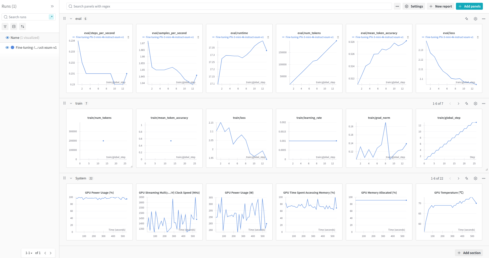
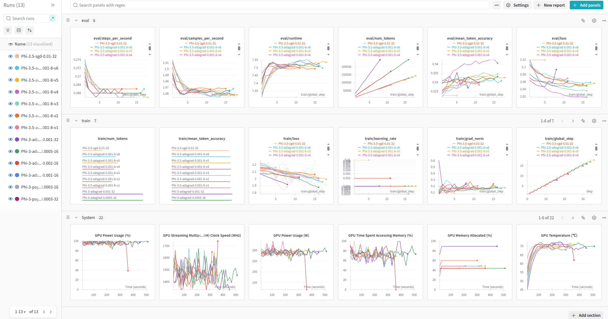
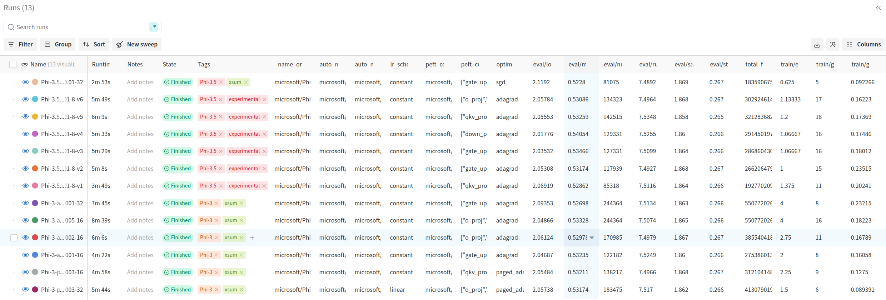

# Getting Started with Weights & Biases for Machine Learning Experimentation

This guide introduces you to using Weights & Biases (W&B) for tracking machine learning experiments, specifically focusing on fine-tuning a Large Language Model (LLM) with the `transformers` library.

If your `transformers` pipeline is already set up, feel free to skip ahead to the "Weights & Biases Configuration" section.

## Initial setup

### Create an account

Ensure you have a Weights & Biases account. You can sign up at the [Weight&Biases website](https://wandb.ai/login).

### Prerequisities

To begin, update your system and install the Python development headers:

```bash
sudo apt-get update
sudo apt-get install python3-dev -y
```

Next, install the necessary Python libraries. If you've just created your environment, use the following command:

```bash
pip install bitsandbytes==0.45.4 datasets==3.5.0 peft==0.15.1 transformers==4.50.2 trl==0.16.0 wandb==0.19.8
```

## Importing modules

For better organization, begin by importing all required modules:

```python
import os
import torch
import wandb

from datasets import load_dataset, Dataset
from peft import get_peft_model, LoraConfig, prepare_model_for_kbit_training
from transformers import AutoModelForCausalLM, AutoTokenizer, BitsAndBytesConfig, EarlyStoppingCallback
from transformers.integrations import WandbCallback
from trl import SFTConfig, SFTTrainer
```

## Model and Dataset Preparation

In this section, we'll prepare the model and dataset for experimentation. While we won't delve into the details of fine-tuning LLMs here, you can refer to our detailed guide on best practices for LLM fine-tuning in our Cookbook on `XXX`.

### Configuring Bits and Bytes

Set up the `bitsandbytes` configuration:

```python
bnb_config = BitsAndBytesConfig(
    load_in_4bit=True,
    bnb_4bit_quant_type="nf4",
    bnb_4bit_use_double_quant=True,
    bnb_4bit_compute_dtype=torch.float32
)
```

### Model Preparation

Load and configure your model:

```python
repo_id = 'microsoft/Phi-3-mini-4k-instruct'
model = AutoModelForCausalLM.from_pretrained(
    repo_id, device_map="cuda:0", quantization_config=bnb_config
)

model = prepare_model_for_kbit_training(model)
config = LoraConfig(
    r=8,
    lora_alpha=16,
    bias="none",
    lora_dropout=0.05,
    task_type="CAUSAL_LM",
    target_modules=['o_proj', 'qkv_proj', 'gate_up_proj', 'down_proj'],
)

model = get_peft_model(model, config)
```

### Dataset Preparation

Prepare your dataset:

```python
train_dataset = load_dataset("EdinburghNLP/xsum", split="train")
test_dataset = load_dataset("EdinburghNLP/xsum", split="test")

def rename_columns(dataset: Dataset):
    return dataset.rename_column("document", "prompt").rename_column("summary", "completion").remove_columns("id")

train_dataset = rename_columns(train_dataset)
test_dataset = rename_columns(test_dataset)
```

For simplicity, we'll use a smaller subset of the dataset:

```python
train_dataset = train_dataset.take(200)
test_dataset = test_dataset.take(50)
```


### Tokenizer setup
Initialize the tokenizer:

```python
tokenizer = AutoTokenizer.from_pretrained(repo_id)
```

## Weights & Biases Configuration

### Environment Variables

Set the necessary environment variables to access Weights & Biases and save model artifacts. Follow the instructions [here](https://docs.wandb.ai/support/find_api_key/) to find your API key. For a complete list of environment variables, refer to the [documentation](https://docs.wandb.ai/guides/track/environment-variables/):

```bash
WANDB_API_KEY=
WANDB_LOG_MODEL=checkpoint
```

### Logging in

Log in to W&B:

```python
wandb.login(key=os.environ["WANDB_API_KEY"])
```

## Tracking Your First Experiment

### Configuring Training Parameters

Set up your training parameters using `SFTConfig` and configure logging to W&B. Remember to set `report_to` to `wandb`:

```python
args = SFTConfig(
    num_train_epochs=10,
    per_device_train_batch_size=16,
    learning_rate=1e-3,
    optim='adagrad',

    gradient_checkpointing=True,
    gradient_checkpointing_kwargs={'use_reentrant': False}, 
    gradient_accumulation_steps=1,  

    lr_scheduler_type='constant',
    packing=True,
    metric_for_best_model="eval_loss",
    output_dir="Fine-tuning-Phi-3-mini-4k-instruct-xsum-v1",

    logging_strategy="steps",
    logging_steps=1,
    eval_strategy="steps",
    eval_steps=1, 

    report_to="wandb"  # Ensure this is set
)
```

### Initializing the Run

Initialize your W&B run:

```python
wandb.init(
    project="Summarization-of-articles",
    name="Fine-tuning-Phi-3-mini-4k-instruct-xsum-v1",
    tags=["baseline", "Phi-3", "xsum"],
)
```

### Starting the Training Process

Start the training process:

```python
trainer = SFTTrainer(
    model=model,
    processing_class=tokenizer,
    args=args,
    train_dataset=train_dataset,
    eval_dataset=test_dataset,
    callbacks=[EarlyStoppingCallback(
        early_stopping_patience=3,
        early_stopping_threshold=0.002,
    )]
)

trainer.train()
```
### Finalizing the Run

Remember to finish your W&B run if you're using a notebook:

```python
wandb.finish()
```

## Visualizing Results

After training, check your run on the W&B dashboard under your project:



Running multiple experiments in the same project fills your dashboard with more runs and training curves.



You can still see only one run by clicking the run name in the project dashboard.

For detailed information about all of the runs, expand the Runs panel (shortcut: Ctrl+J):




## Logging Custom Metrics

By default, Weights & Biases automatically logs a variety of metrics related to training, evaluation, and system performance. These include metrics like mean token accuracy, training and test losses, GPU power usage, and GPU temperature, among others. However, you can also log your own metrics. To do this, subclass `WandbCallback` and use methods like `on_train_end` to log metrics with `wandb.log()`. You can check out all of the methods in the [Huggingface docs](https://huggingface.co/docs/transformers/v4.50.0/en/main_classes/callback#transformers.TrainerCallback).

```python
# trainer = SFTTrainer( ... )

class WandbCustomMetricCallback(WandbCallback):
    def on_train_end(self, args, state, control, **kwargs):
        super().on_train_end(args, state, control, **kwargs)

        ...  # calculate metric

        wandb.log({"metric_name": metric_value})

trainer.add_callback(WandbCustomMetricCallback())

# trainer.train()
```

Organize metrics into categories by prefixing names:

```python
wandb.log({"train/metric": metric_value})
wandb.log({"eval/metric": metric_value})
```

You can also create new categories:

```python
wandb.log({"new_category/metric": metric_value})
```

## Downloading and Using a Model Artifact

To download and use a model from W&B:

```python
run = wandb.init()

artifact = run.use_artifact(f'{org-name}/{name-of-the-project}/{model-name}:{version}', type='model')
model_dir = artifact.download()

model = AutoModelForCausalLM.from_pretrained(
    model_dir,
    device_map="cuda:0",
    quantization_config=bnb_config
)
```

# Conclusion

In this guide, we explored the fundamentals of using Weights & Biases for experiment tracking. For more in-depth information and additional features, be sure to visit the [Weights & Biases documentation](https://docs.wandb.ai/quickstart/).
